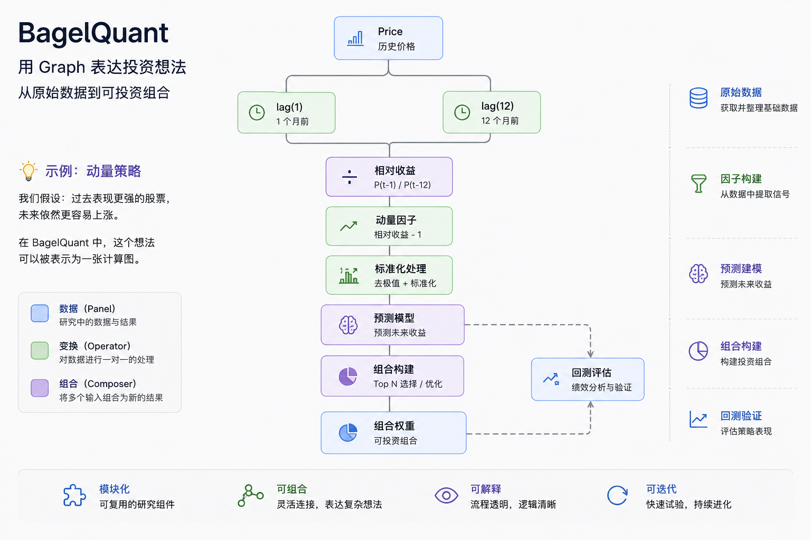

# BagelQuant

## 重新思考量化研究

大多数量化研究并不是从模型开始，而是从一个想法开始。

也许是： “价值股长期跑赢市场。”

也许是：“分析师预期修正会提前反映未来收益。”

也许只是一个简单的问题：如果把这些信息组合起来，会发生什么？

但随着研究深入，问题开始出现。 脚本越来越多，依赖越来越复杂，实验无法复现，模型越来越像黑箱！

最终，我们失去了研究最重要的东西：

**理解过程**

BagelQuant 希望重塑这件事。

## 用 Graph 表达投资想法

在 BagelQuant 中，任何研究流程都被表示为一张计算图（Graph）。包括数据流动，节点变换，结果组合，最终形成投资组合。例如，一个简单的动量策略：

我们假设：

> 过去表现更强的股票，未来依然更容易上涨。

传统研究里，这可能分散在几十个脚本和不同系统之中。而在 Graph 中，它可以表达为：

每一个节点都是研究中的一个步骤。在Bagelquant中，

节点可以被替换、组合和复用。

你可以将动量替换成价值因子。

将线性模型替换成神经网络。

将 Top N 替换成风险约束优化。

而整个研究过程仍然保持清晰。

研究不再是一堆脚本。

而成为一个能够持续迭代的系统。

## 不只是框架

BagelQuant 同时也是一个持续积累中的知识库。

从数学基础，到金融理论。

从因子研究，到预测模型。

从组合构建，到真实交易环境下的验证。

希望帮助研究者真正理解：

投资想法如何变成可投资组合。

## 从这里开始

- 快速开始
- 学习
- 研究
- 文档

## 未来应用

未来的 BagelQuant App 将提供图形化研究界面。

通过连接节点完成：

因子 → 模型 → 组合 → 回测

无需重新搭建整个研究系统。

## About Me

BagelQuant 由 [Yanzhong (Eric) Huang](about-me.md) 维护。

股票量化研究员，关注因子研究、预测建模、组合构建与研究基础设施。

希望将量化研究从零散实验升级为可组合、可复现、可持续演进的研究系统。